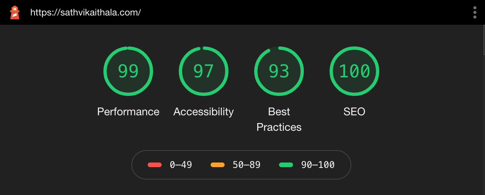

# Professional Portfolio

This repository houses the code for my professional portfolio website, [sathvikaithala.com](https://sathvikaithala.com).

---

## Project Description

After successfully completing my Data Analytics Boot Camp, I wanted to build a website that would accomplish two things: 
  1) Allow me to practice some skills I learned in the class (HTML and CSS) outside of the classroom setting.
  2) Showcase the work I've put in both in and out of the class in an easy-to-share way.
  
  
## The Initial Build

I started this project by using a template provided to me through the Boot Camp. Since the course only focused on HTML and CSS for two weeks, I was apprehensive of my ability to put something together without the guided instruction we had received in the course.

While the template included "About Me", "Porfolio", "Education", and "Contact" sections, there were a lot of extraneous CSS elements and lines of code in the HTML file. In my desire to eventually revamp the whole website, I broke down my project into a few goals:

- <b>Easy Wins:</b> Changes I would be able to implement quickly and with only the information provided to us through the course.
  - Updating the code with my own content, namely my photo and links.
  - Updating the color scheme.
  - Filling out information in place of the template's "lorem ipsum" text.
  
- <b>Incremental Improvements:</b> Making subtle changes that focus on code efficiency and cleanliness, but don't have much of an impact on the webpage as seen by someone visiting the site.
  - Using `:root` to tidy up the color scheme. Rather than having hex codes interspersed throughout the CSS file, this little trick allowed me to make changes in just one place. An added benefit of this is that it makes replicating this template for future websites much easier. If I decide to change from a blue theme to a different color, this makes it possible with very little effort.
  - Changing most of the CSS elements to better match my naming scheme and website layout. I also changed or removed a lot of the code from the template that served no purpose, or could be written in a more efficient manner.
  - Fixed padding, spacing, and fonts to make the page more visibly appealing.
  - Using Font Awesome to personalize the icons used for my links and projects.
  - Customizing hyperlink interactions, like link color, hover color, removing underlines, and making the pages open in a separate tab rather than redirecting the current tab.
  
- <b>Restructuring:</b> Some major changes to the format, intended to practice new skills as well as improve website flow.  
  - Creating a completely separate Contacts page.
  - Adding a navigation bar to switch between the Home page and the Contacts page.
  

## Updates, Improvements, and Lessons Learned Along the Way

After completing the initial website design, I knew there were a lot of ways I could increase efficiency. I also found that my website needed to be optimized for mobile devices, as a lot of the text was too large, and the elements did not flow together very well. 

After many small changes and a lot of self-education, I'm happy with the results!

## Future Plans

As I progress in my career as a data analyst, I plan on taking on more projects to practice my skills and showcase my abilities. 

In the future, I plan on building a separate page for these projects to be housed, rather than just the select few I've showcased currently. This should make the Home page a bit cleaner, while allowing me to talk about my projects more in depth without cluttering up the site.

## Conclusion

In the few days I spent working on this website, I have learned a lot about web development, design, code etiquette, and troubleshooting. I've also gained a new-found sense of confidence in my abilities to tackle projects that I designed on my own.

<i>Thanks for joining me on this journey, as I learn to use my new skills and work on some interesting projects!</i>
